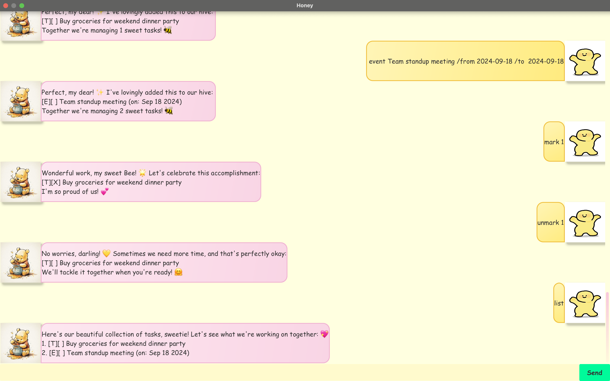

# Honey User Guide

Honey is your SWEET~ **personal task manager** that helps you keep track of your todos, deadlines, and events through a simple chat interface. It's optimized for use via a Command Line Interface (CLI) while still having the benefits of a Graphical User Interface (GUI).

## Quick Start

1. Ensure you have Java `17` or above installed in your Computer.
2. Download the latest `honey.jar` file from [here](https://github.com/soakedumplings/ip/releases).
3. Copy the file to the folder you want to use as the home folder for your Honey.
4. Open a command terminal, `cd` into the folder you put the jar file in, and use the `java -jar honey.jar` command to run the application.
5. Type commands in the command box and press Enter to execute them. Some example commands you can try:
   * `list` : Lists all tasks.
   * `todo read book` : Adds a todo task named "read book" to the task list.
   * `delete 3` : Deletes the 3rd task shown in the current list.
   * `bye` : Exits the app.
6. Refer to the [Features](#features) below for details of each command.

## Features

> **Notes about the command format:**
> * Words in `UPPER_CASE` are the parameters to be supplied by the user.
>   e.g. in `todo DESCRIPTION`, `DESCRIPTION` is a parameter which can be used as `todo read book`.
> * Parameters cannot be empty unless specified otherwise.
> * Commands are case-sensitive and should be typed in lowercase.

### Adding a todo: `todo`

Adds a simple task to your task list.

Format: `todo DESCRIPTION`

Examples:
* `todo read book`
* `todo buy groceries`

### Adding a deadline: `deadline`

Adds a task with a due date to your task list.

Format: `deadline DESCRIPTION /by DATE`

* `DATE` can be in format `YYYY-MM-DD` or `DD/MM/YYYY` optionally with time `HHMM` or `HH:MM`

Examples:
* `deadline submit assignment /by 2023-12-15`
* `deadline submit report /by 15/12/2023 1800`
* `deadline team meeting /by 2023-12-20 14:30`

### Adding an event: `event`

Adds an event with start and end times to your task list.

Format: `event DESCRIPTION /from START /to END`

* `START` and `END` can be in format `YYYY-MM-DD` or `DD/MM/YYYY` optionally with time `HHMM` or `HH:MM`

Examples:
* `event team meeting /from 2023-12-10 /to 2023-12-11`
* `event conference /from 2023-12-15 09:00 /to 2023-12-15 17:00`

### Listing all tasks: `list`

Shows a list of all tasks in your task list.

Format: `list`

### Marking a task as done: `mark`

Marks the specified task as completed.

Format: `mark INDEX`

* Marks the task at the specified `INDEX` as done.
* The index refers to the index number shown in the displayed task list.
* The index **must be a positive integer** 1, 2, 3, ... AND within the maximum length of the task list at that time

Examples:
* `list` followed by `mark 2` marks the 2nd task in the task list as done.

### Marking a task as not done: `unmark`

Marks the specified task as not completed.

Format: `unmark INDEX`

* Marks the task at the specified `INDEX` as not done.
* The index refers to the index number shown in the displayed task list.
* The index **must be a positive integer** 1, 2, 3, ... AND within the maximum length of the task list at that time

Examples:
* `list` followed by `unmark 1` marks the 1st task in the task list as not done.

### Deleting a task: `delete`

Deletes the specified task from the task list.

Format: `delete INDEX`

* Deletes the task at the specified `INDEX`.
* The index refers to the index number shown in the displayed task list.
* The index **must be a positive integer** 1, 2, 3, ... AND within the maximum length of the task list at that time

Examples:
* `list` followed by `delete 2` deletes the 2nd task in the task list.

### Finding tasks by keyword: `find`

Finds tasks whose descriptions contain the given keyword.

Format: `find KEYWORD`

* The search is case-sensitive.
* Tasks matching the keyword will be displayed.

Examples:
* `find book` returns tasks containing "book" in their description
* `find assignment` returns tasks containing "assignment" in their description

### Finding tasks due on a date: `due`

Shows all deadline tasks that are due on the specified date.

Format: `due DATE`

* `DATE` should be in format `YYYY-MM-DD`
* Only shows deadline tasks, not events or todos

Examples:
* `due 2023-12-15` shows all tasks due on 15 December 2023

### Sorting tasks: `sort`

Sorts deadline tasks by their due dates.

Format: `sort deadline`

* Only deadline tasks are sorted
* Tasks are arranged from earliest to latest due date

### Exiting the program: `bye`

Exits the program. Window closes.

Format: `bye`

## Command Summary

| Action | Format, Examples |
|--------|------------------|
| **Add Todo** | `todo DESCRIPTION`   e.g., `todo read book` |
| **Add Deadline** | `deadline DESCRIPTION /by DATE`   e.g., `deadline submit assignment /by 2023-12-15` |
| **Add Event** | `event DESCRIPTION /from START /to END`   e.g., `event meeting /from 2023-12-10 /to 2023-12-11` |
| **List** | `list` |
| **Mark** | `mark INDEX`   e.g., `mark 3` |
| **Unmark** | `unmark INDEX`   e.g., `unmark 1` |
| **Delete** | `delete INDEX`   e.g., `delete 2` |
| **Find** | `find KEYWORD`   e.g., `find book` |
| **Due** | `due DATE`   e.g., `due 2023-12-15` |
| **Sort** | `sort deadline` |
| **Exit** | `bye` |